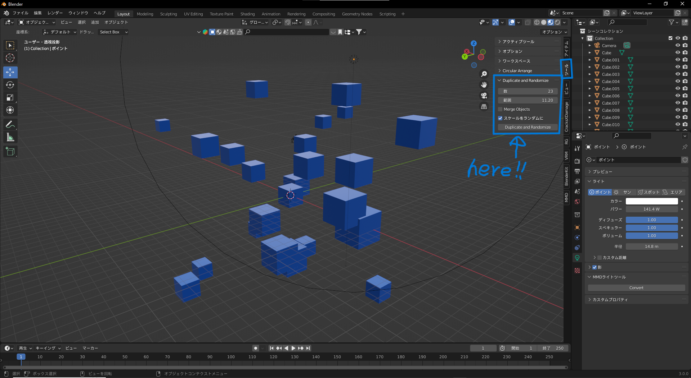

# Duplicate Randomize v1.2.0 – for Blender 2.8.0 and above

**Duplicate Randomize** is a Blender add-on that allows you to duplicate a selected object and place the duplicates randomly within a specified range.  
Just install `Duplicate_Randomize.py` via *Edit > Preferences > Add-ons*, then enable the checkbox to activate it.

## How to Use

1. **Select the object** you want to duplicate and press the `N` key to open the right-hand toolbar.
2. Under the tool tab, find **"Duplicate and Randomize"**.  
   Set your desired **Count** (number of duplicates) and **Range**, then click the `Duplicate and Randomize` button.
3. Enable **Merge Objects** if you want to join the duplicated objects into one.
4. Enable **Randomize Scale** to apply random scaling to each duplicated object.
5. Enable **Randomize Rotation** to randomize the rotation of each duplicated object.  
   You can set the maximum rotation range (± degrees) with **Rotation Range (deg)**.

