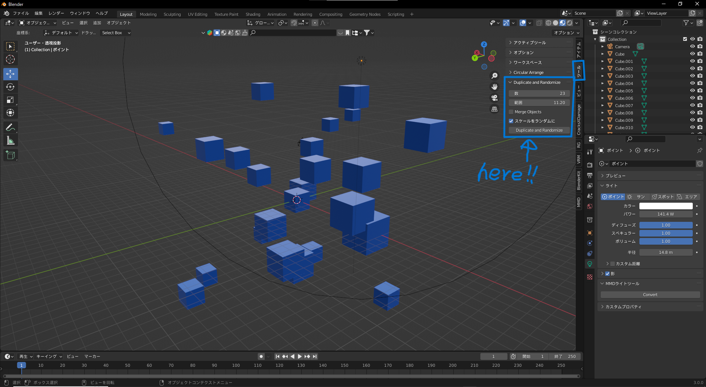

# Duplicate Randomize v1.2.0 / blender version 2.8.0 or higher

Duplicate Randomizeは、オブジェクトを選択し数と範囲を指定して範囲内にランダムに配置できるアドオンです。`Duplicate_Randomize.py`をプリファレンスからインストールし、チェックボックスで有効化すると使えるようになります。

## English
📄 [Click here for the English README](./README-EN.md)

## 使い方

1. **複製・ランダム配置したいオブジェクトを選択**した状態で`n`キーを押し、ツールバーからツールを選択します。
2. ツールに`Duplicate and Randomize`が表示されているので、**Count（数）とRange（範囲）**をお好みの数値に設定し、`Duplicate and Randomize`をクリックするとオブジェクトがランダム配置されます。
3. **Merge Objects**にチェックを入れると、ランダム配置されたオブジェクトを統合します。
4. **Randomize Scale**にチェックを入れると、配置されるオブジェクトをランダムにスケール変更します。
5. **Randomize Rotation**にチェックを入れると、配置されるオブジェクトの回転もランダム化されます。**Rotation Range (deg)**で回転の最大範囲（±度数）を指定できます。

